# Retail Sales Analysis with SQL and Tableau

---
## Project Overview

This project analyzes an online retail dataset to uncover revenue trends, customer behavior, and sales performance across products and countries. Using **PostgreSQL** for data preparation and **Tableau** for visualization, I created an interactive dashboard highlighting key performance indicators (KPIs) and business insights.

The goal of this project is to demonstrate my ability to:

- Clean and aggregate raw transactional data using **SQL**  
- Build calculated fields and KPIs for decision-making  
- Design a clear, interactive Tableau dashboard for stakeholders  

## Interactive Dashboard

View the full interactive Tableau dashboard here:  
[Tableau Public – Online Retail Dashboard](https://public.tableau.com/app/profile/ben.mihelic/viz/OnlineRetailAnalysis_17558674772550)

---

## ⚙️ Tools & Technologies

- **Dataset:** [UCI Machine Learning Repository – Online Retail Dataset](https://archive.ics.uci.edu/ml/datasets/online+retail)  
- **PostgreSQL (psql shell):** data cleaning, joins, aggregation  
- **SQL:** grouping, filtering, creating CSV extracts  
- **Tableau Public:** visualization and dashboard design  
- **GitHub:** project documentation and portfolio publishing  
## Project Workflow

### 1. Data Source
- Dataset: [Online Retail (UCI Machine Learning Repository)](https://archive.ics.uci.edu/ml/datasets/online+retail)  
- Raw format: CSV containing invoice-level transactions.  

Original Dataset viewed in LibreOffice
  
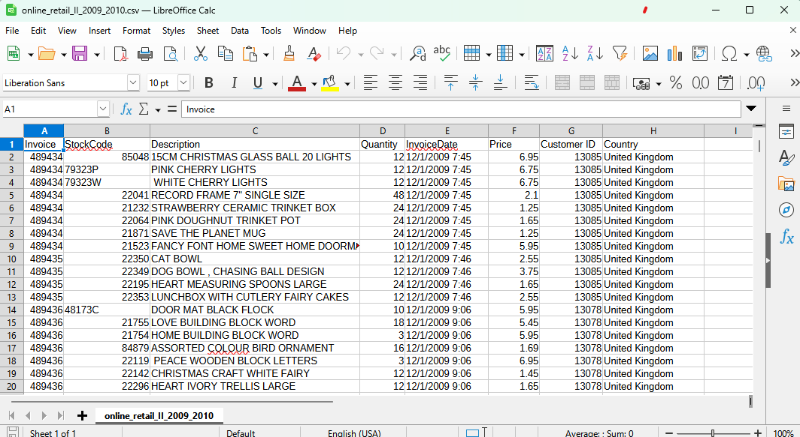

---

### 2. Data Preparation in PostgreSQL
I used **psql** shell to load the dataset into a PostgreSQL database, then created summary tables/CSVs for Tableau.

I had to reformat the invoicedate column in order to extract just the year and month to use in the analysis.

Original table structure used to upload the csv.

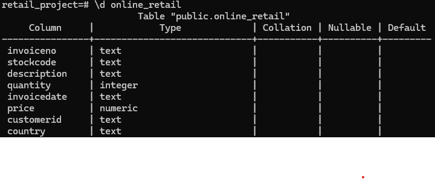

Snapshot of dataset with added formatted date and yearmonth columns to use in monthly revenue and average order size csv's.

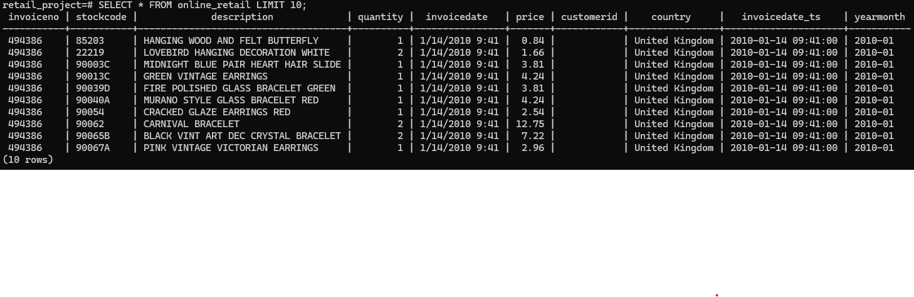

Monthly Revenue Query

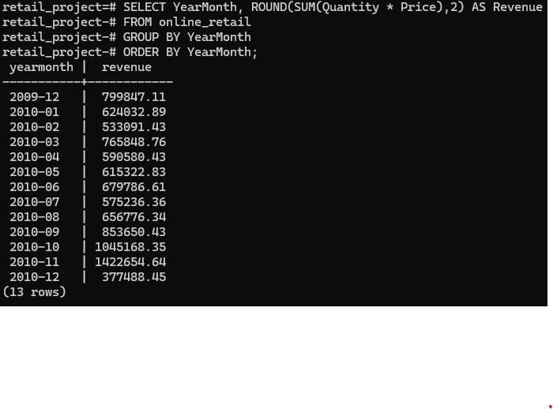

Average Order Size Query
  
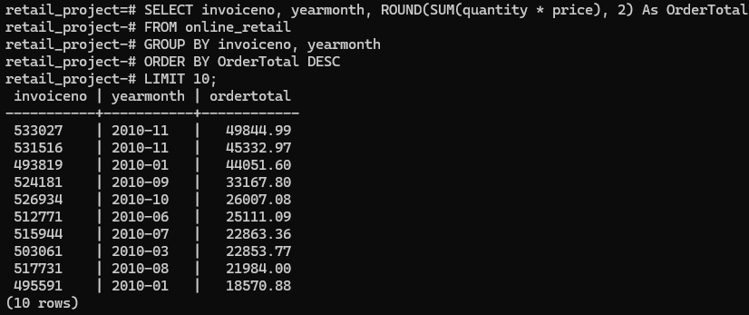

Top 10 Countries by Revenue Query
  
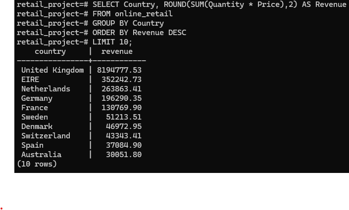

Top 10 Products by Revenue Query
  
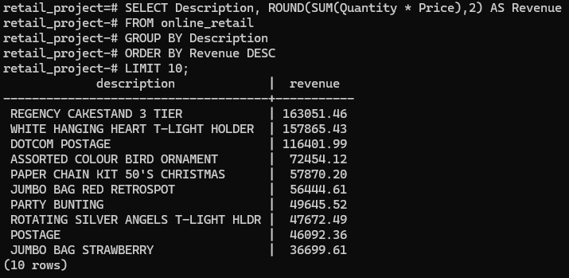

### 3. Exported Data
The queries above were exported into 4 CSV files for Tableau using the \copy function inside the psql shell.

Example output:  monthly_revenue.csv viewed in LibreOffice

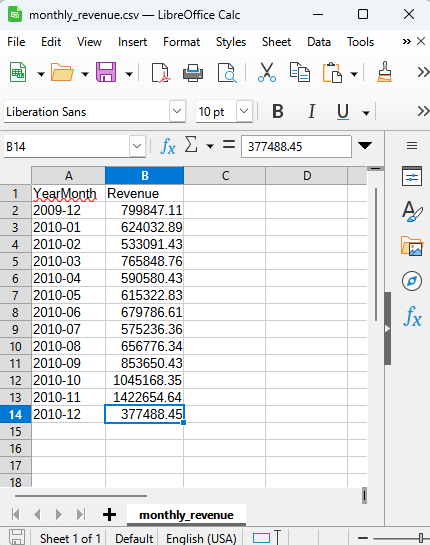

### 4. Tableau Visualizations
The CSVs were imported into Tableau to build interactive charts:

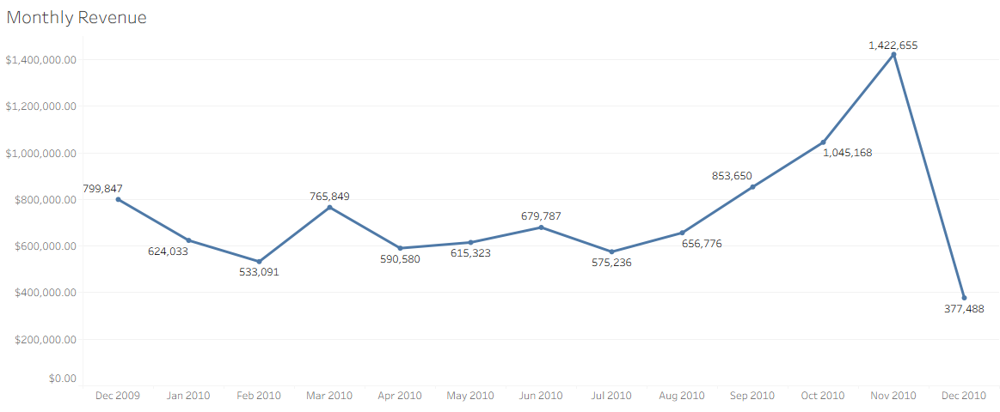

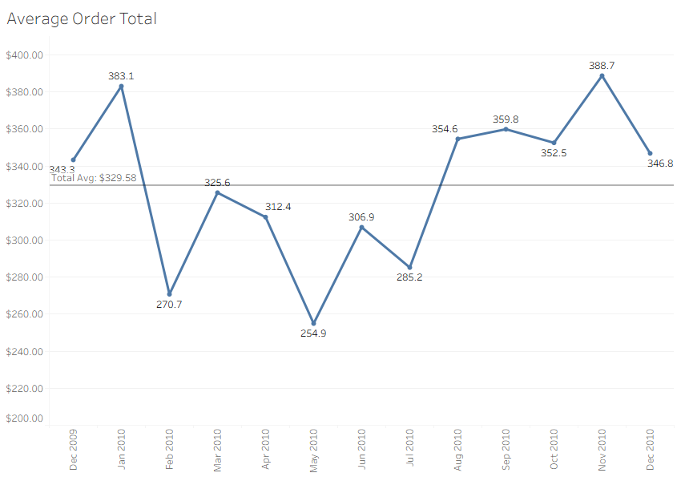

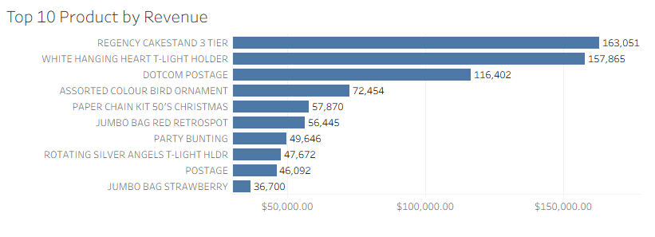

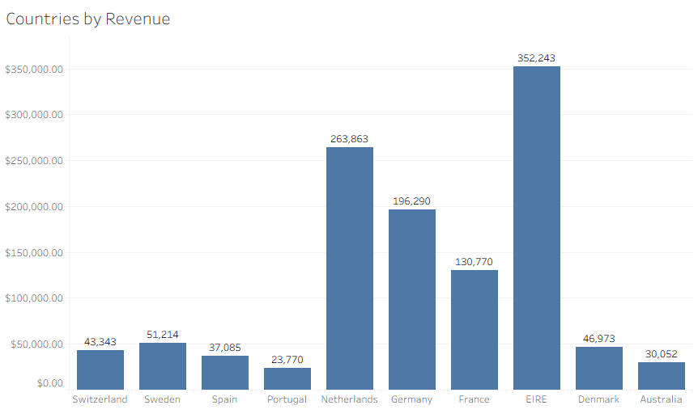

### 5. Key Performance Indicator (KPI) Dashboard
Created a dashboard with 6 key KPIs across the top:

Total Revenue, Average Order Size, Average Monthly Revenue, Total Orders, Average Country Revenue (excluding UK), Average Product Revenue

Reference lines were added to highlight averages.

Final Dashboard:

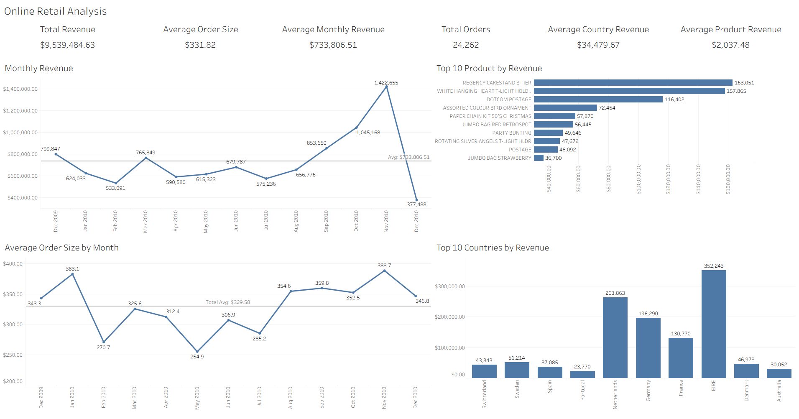

🚀 Key Insights
Revenue is highly concentrated in the UK, so global averages were recalculated excluding it.

Seasonal patterns appear in monthly revenue trends.

A small number of products drive the majority of sales.

🛠️ Tech Stack
PostgreSQL (psql shell) — data cleaning and SQL transformations

Tableau Public — dashboards and KPI visualizations

GitHub — documentation and version control

