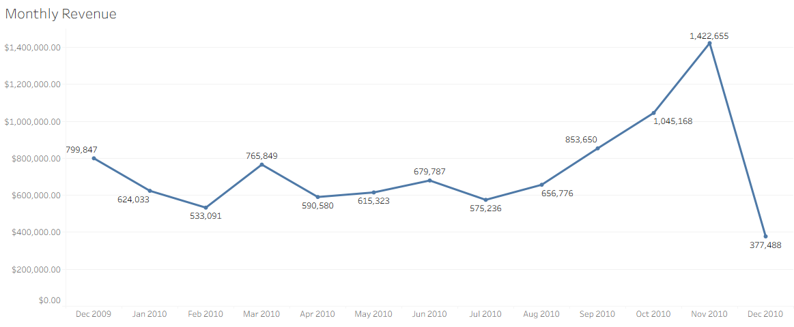
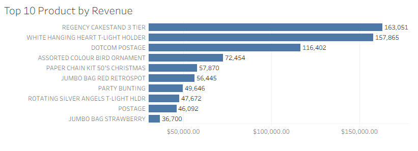
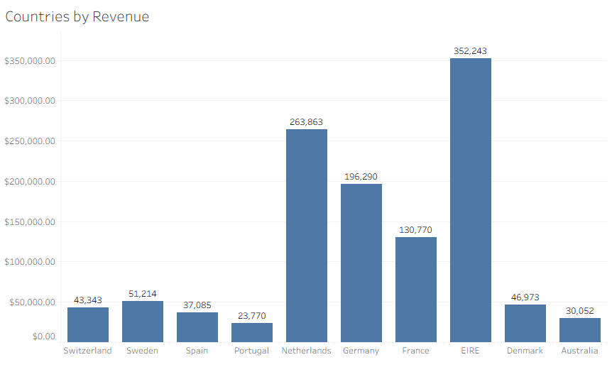
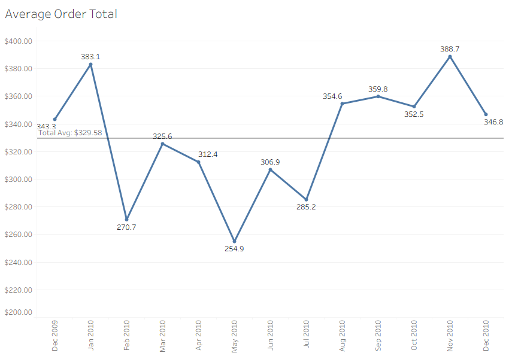

# Retail Sales Analysis with SQL and Tableau

This project analyzes an [Online Retail dataset](https://archive.ics.uci.edu/ml/datasets/online+retail) using **PostgreSQL** for data preparation and **Tableau** for visualization.  
The goal is to transform raw transaction data into clear business insights through **KPIs, dashboards, and visual analytics**.

---

## Project Workflow

### 1. Data Source
- Dataset: [Online Retail (UCI Machine Learning Repository)](https://archive.ics.uci.edu/ml/datasets/online+retail)  
- Raw format: CSV containing invoice-level transactions.  

Original Dataset viewed in LibreOffice
  

---

### 2. Data Preparation in PostgreSQL
I used **psql** shell to load the dataset into a PostgreSQL database, then created summary tables/CSVs for Tableau.

I had to reformat the invoicedate column in order to extract just the year and month to use in the analysis.

Original table structure used to upload the csv.

Snapshot of dataset with added formatted date and yearmonth columns to use in monthly revenue and average order size csv's.

Monthly Revenue Query

Average Order Size Query
  

Top 10 Countries by Revenue Query
  

Top 10 Products by Revenue Query
  

### 3. Exported Data
The queries above were exported into 4 CSV files for Tableau using the \copy function inside the psql shell.

Example output:  monthly_revenue.csv viewed in LibreOffice

4. Tableau Visualizations
The CSVs were imported into Tableau to build interactive charts:

Monthly Revenue (Line Chart)

Top 10 Products by Revenue (Bar Chart)

Top 10 Countries by Revenue (Bar Chart, excluding UK in KPI calc)

Average Order Value (Line Chart)

5. KPI Dashboard
Created a dashboard with 6 key KPIs across the top:

Total Revenue

Average Order Size

Average Monthly Revenue

Total Orders

Average Country Revenue (excluding UK)

Average Product Revenue

Reference lines were added to highlight averages.

🚀 Key Insights
Revenue is highly concentrated in the UK, so global averages were recalculated excluding it.

Seasonal patterns appear in monthly revenue trends.

A small number of products drive the majority of sales.

🛠️ Tech Stack
PostgreSQL (psql shell) — data cleaning and SQL transformations

Tableau Public — dashboards and KPI visualizations

GitHub — documentation and version control

